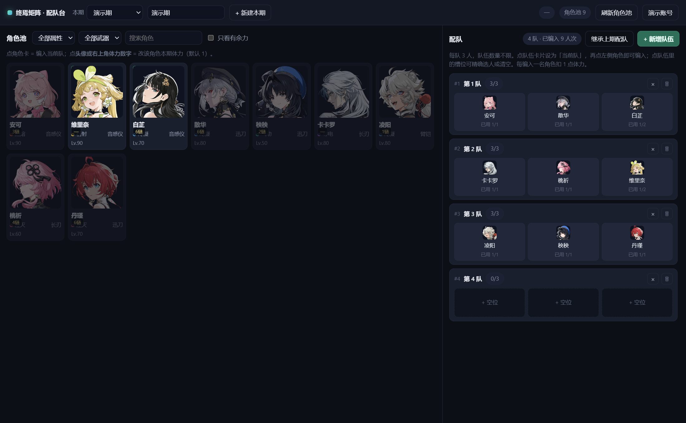
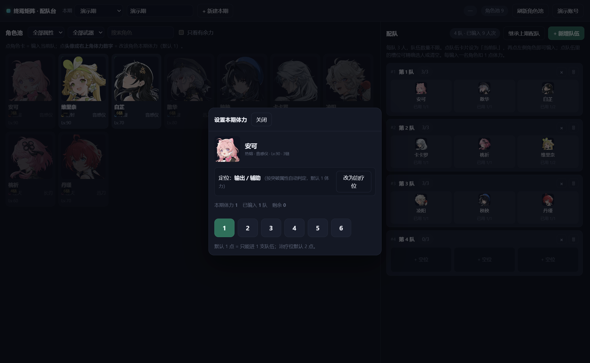
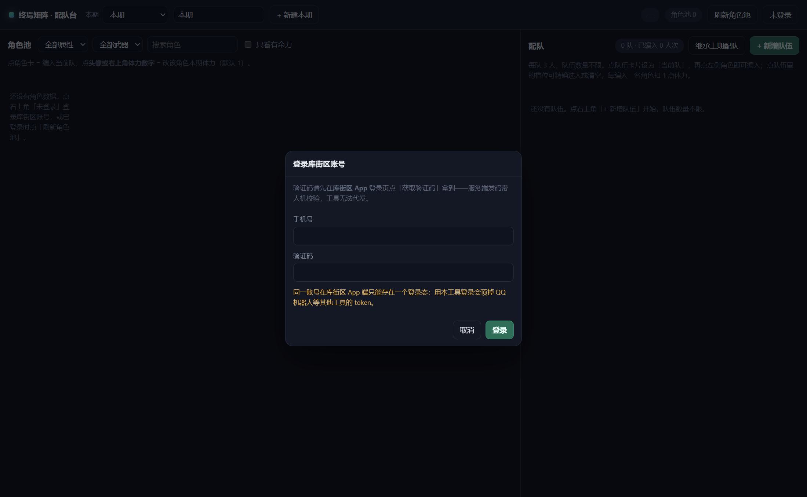

# 终焉矩阵 · 配队台

给《鸣潮》终焉矩阵用的**配队 / 体力管理**桌面工具。

解决的核心问题：**每期加成角色一换，上期配好的队伍就全废了。**

[](LICENSE)




---

## 它解决什么

终焉矩阵要消耗大量角色体力，而**每期的加成角色都在轮换**——上期辛苦配好的十几支队伍，
下期可能一半用不了。手动重配一次要十几分钟，而且很容易配到一半发现某个角色体力不够。

这个工具把这件事拆成三件可管理的事：

| 痛点 | 工具里的对应 |
| --- | --- |
| 角色体力就一点，要盯着别超 | 每张角色卡实时显示 **剩余/容量**；用尽的自动置灰、编不进去；编入次数超出体力时，队伍卡和角色卡同时标红 |
| 想配几个队就配几个队 | 队伍数量不限。点队伍卡片设为「当前队」，再点角色即编入 |
| 上期配好，下期全打乱 | **「继承上期配队」**：一键把上期队伍原样搬过来，**体力不够的位置自动标红**——只需改坏掉的那几个位置 |

<br>

## 功能

- **角色池** —— 自动从库街区拉取你账号拥有的全部角色：头像 / 属性 / 武器 / 等级 / 共鸣链
- **体力模型** —— 默认 **1 点**（只能进 1 支队伍）；判定为**治疗位**的角色默认 **2 点**；都能单独改
- **治疗位识别** —— 治疗角色卡片带绿色「治疗」标，自动按 2 体力算
- **配队窗口** —— 每队 3 人，队伍数量不限；冲突实时拦截并标红
- **跨期继承** —— 一期一份方案，新建下一期后一键继承上期配队
- **完全离线可用** —— 头像首次启动下载到本地缓存后，之后启动零网络请求

### 改单个角色的体力

点角色卡的**头像**或**右上角体力数字**：



弹窗里可以快捷选 1–6 体力、一键恢复默认，也能纠正治疗位判定（写进当期，不影响其它期）。

---

## 运行

### 方式一：直接跑源码（推荐）

需要 **Node.js 20+**。

```bash
git clone https://github.com/lNeko-afk/Wuwa-Matrix.git
cd wuwa-matrix
npm install
npm start
```

Windows 上也可以双击 `start.bat`（或中文名的 `启动配队台.bat`）。

### 方式二：打包成 exe

```bash
npm run dist
```

产物在 `dist/`。本项目刻意设置 **`asar: false`**：exe 只作为入口，源码就是旁边可读的文件，
不打成不可查看的黑盒。

---

## 使用

### 1. 登录

首次启动会要求登录**库街区账号**（手机号 + 短信验证码）：



**两种拿验证码的方式，任选：**

- **点工具里的「发送验证码」** —— 会弹出一个小窗口过人机校验，划一下通过后自动把短信发到你手机，**手机上不用再输一遍号码**。
- **在库街区 App 里点「获取验证码」** —— 拿到 6 位数填进工具即可。

登录过一次之后，工具会**记住手机号**（加密存储），之后只需要输验证码。

> ⚠️ **登录会让其它库街区客户端掉线** —— 库街区 App、微信里的鸣潮小工具、岸宝机器人等 QQ 机器人，
> 之后各自都需要重新登录。详见下方「常见问题」。

### 2. 如果拉取角色时报「角色数据未开放展示」

去库街区 App 的数据终端里把**对外展示**开关打开。

### 3. 配队

1. 点「+ 新增队伍」
2. 点队伍卡片把它设为「当前队」（高亮）
3. 点左侧角色即编入；也可点具体槽位精确选人或清空
4. 新一期：点「+ 新建本期」，再点「继承上期配队」

---

## 数据与隐私

工具需要用到你的库街区账号，所以这里把安全设计讲清楚：

| 事项 | 做法 |
| --- | --- |
| **凭据加密落盘** | token / did / **手机号** 都用 Electron `safeStorage` 加密后存储（Windows 上底层是 **DPAPI**，密钥绑定当前操作系统账户）。文件被拷到别的机器或别的用户下**解不开**，会当作未登录 |
| **凭据不进入界面进程** | token 只存在于 Electron 主进程。发给页面的配置里**根本没有** `credentials` 字段，页面即使被注入也拿不到凭据 |
| **手机号不进界面进程** | 界面只显示打码值（如 `138****0000`）；登录时渲染层**只回传验证码**，完整号码由主进程补上 |
| **凭据不出现在仓库** | 数据目录 `.data/` 已在 `.gitignore` 中；仓库里不含任何账号数据、也不含游戏素材 |
| **头像不入库** | 角色头像运行时从官方 CDN 下载到 `.data/icons/` 本地缓存；仓库不分发任何游戏美术资源 |
| **人机校验脚本被隔离** | 「发送验证码」用的极验控件跑在一个**独立的空窗口**里 —— 那里面没有任何应用数据、也没有输入框。主界面仍是 `file://` 加载，CSP 不放行任何第三方域名。即使那个第三方脚本被劫持，也拿不到 token，最坏只能触发一次发码尝试 |
| **调试钩子不可用** | 截图/注入类调试开关只在未打包的开发态生效，且注入任意 JS 需要额外显式打开第二个开关 |

数据默认存在**项目目录下的 `.data/`**（便携，方便备份和检查）：
可以用环境变量 `WUWA_DATA_DIR` 改到别处。

> ⚠️ 备份或分享 `.data/` 前请注意：里面除了加密的凭据，还有你的**角色池和配队方案**。
> 凭据本身因加密而无法在别人机器上解密，但角色池属于你的账号信息。

---

## 已知限制

- **矩阵的角色体力没有任何接口能拿到**。作者扫过库街区全部游戏数据接口
  （`challengeDetails` / `towerData` / `calabash` / `explore` / `dailyData`），
  全库检索 `矩阵|体力|matrix|stamina` **零命中**。所以体力只能按
  「默认 1 / 治疗位 2」推断，个别不对就点开头像改，当期会记住。
- **治疗位判定按「固有突破属性含治疗效果加成」定义**，覆盖的是专职奶妈。
  以护盾/增益为主、没有治疗突破属性的辅助不会被自动标出——手动改一次即可。
- **主角（漂泊者）不参与判定，体力固定 1 点**：主角可以在多个属性间自由切换，
  按属性去猜会导致判定随切属性跳动。
- 只在 **Windows** 上实测过。macOS / Linux 理论上能跑（Electron 跨平台），但未验证。
- 目前是 **0.1.0**，功能以「配队 + 体力 + 跨期继承」为主；推荐配队尚未实现。

---

## 常见问题

**Q: 登录后我别的工具用不了了？**

库街区账号**同一时间只能有一个登录态**。用本工具登录，会让下面这些已经登录的客户端**全部掉线**，
各自都需要重新登录：

- **库街区 App** 本身
- **微信里的鸣潮小工具**（小程序 / 公众号类）
- **各种 QQ 机器人**，例如岸宝机器人
- 其它任何需要登录库街区的第三方工具

反过来也一样：你在别处重新登录，本工具的凭据同样会失效——在工具里再登一次即可，
**配队数据不会丢**。

**Q: 体力为什么不自动读取？**
见上方「已知限制」——游戏没有开放这个数据。

**Q: 为什么有些角色显示成首字方块？**
角色头像从官方 CDN 下载。首次启动或断网时会退化为首字占位，点「刷新角色池」或联网后重开即可。

---

## 开发

```bash
npm install
npm start                 # 启动
npm run verify            # 端到端校验：凭据可用 / 接口通 / 角色池字段完整
npm run mock              # 用自己的账号数据生成离线预览数据（不提交）
npm run dist              # 打包
```

想核对「这份凭据确实是我本人的账号」，用环境变量传入期望值（这样账号标识不会进仓库）：

```bash
WUWA_EXPECT_ROLE_ID=<特征码> WUWA_EXPECT_ROLE_NAME=<角色名> WUWA_EXPECT_ROLE_COUNT=34 npm run verify
```

### 目录结构

```
src/main/kurobbs.cjs           库街区 API 客户端（零依赖：短信登录 → b-at → 角色列表 → 发码）
src/main/store.cjs             本地 JSON 存储（负责凭据 / 手机号的加密）
src/main/main.cjs              Electron 主进程 + IPC + 头像缓存 + 人机校验小窗
src/main/preload.cjs           contextBridge 暴露面
src/main/captcha-preload.cjs   人机校验小窗的 preload（只暴露「通过 / 取消」）
src/captcha/                   人机校验页：在隔离小窗里以 http://127.0.0.1 加载
src/renderer/app.js            界面逻辑（体力模型 / 配队 / 跨期继承）
src/renderer/healers.js        治疗位名单（数据，由脚本生成）
src/renderer/mock.js           合成演示数据（离线预览 / 截图用，与任何真实账号无关）
scripts/make-mock.mjs          用本机真实数据生成预览数据
scripts/classify-healers.mjs   重新生成治疗位名单（无需登录）
scripts/test-healers.cjs       治疗位判定的自测（无需账号与网络）
scripts/verify.cjs             端到端校验
```

### 离线预览界面

不登录也能看界面：直接用浏览器打开 `src/renderer/index.html`，
会加载 `mock.js` 里的合成演示数据并进入预览模式。

### 调试开关（仅开发态）

| 变量 | 作用 |
| --- | --- |
| `WUWA_DATA_DIR` | 覆盖数据目录 |
| `WUWA_CAPTURE` | 页面加载后自动截图并退出（填入 PNG 路径） |
| `WUWA_CAPTURE_JS` | 截图前注入一段 JS（模拟点击），需同时设 `WUWA_ALLOW_JS_HOOK=1` |

### 重新生成治疗位名单

游戏出新角色后重跑一次分类脚本（库街区 Wiki 接口**无需登录**）：

```bash
node scripts/classify-healers.mjs          # 仅打印结果
node scripts/classify-healers.mjs --write  # 直接更新 src/renderer/healers.js
```

---

## 免责声明

- 本项目是**非官方**的第三方工具，与库洛游戏（Kuro Games）**没有任何关系**，也未获其授权或认可。
- 工具通过库街区的非公开接口读取**你自己账号**的数据。使用此类接口可能违反游戏的用户协议，
  **由此产生的任何后果由使用者自行承担**。
- 本项目**不包含、也不分发**任何游戏美术资源、音频或文本素材。界面中的角色头像由使用者的
  客户端在运行时从其官方 CDN 缓存到本地，仅用于展示使用者自己的账号数据。
- 本项目按原样提供，不对可用性、数据准确性作任何担保。

## 致谢

接口行为与数据结构的摸索，参考了这些社区项目（**仅参考其公开行为，未复制其代码**）：

- [Kuro-API-Collection](https://github.com/TomyJan/Kuro-API-Collection) —— 库街区 API 接口文档
- [WutheringWavesUID](https://github.com/tyql688/WutheringWavesUID) —— 鸣潮 UID 查询机器人
- [wuthering-waves-platform](https://github.com/yangfeng20/wuthering-waves-platform) —— 鸣潮个人数据平台
- [erzaozi/waves-plugin](https://github.com/erzaozi/waves-plugin) —— 上述项目共同的上游

## 许可

[AGPL-3.0-only](LICENSE)
